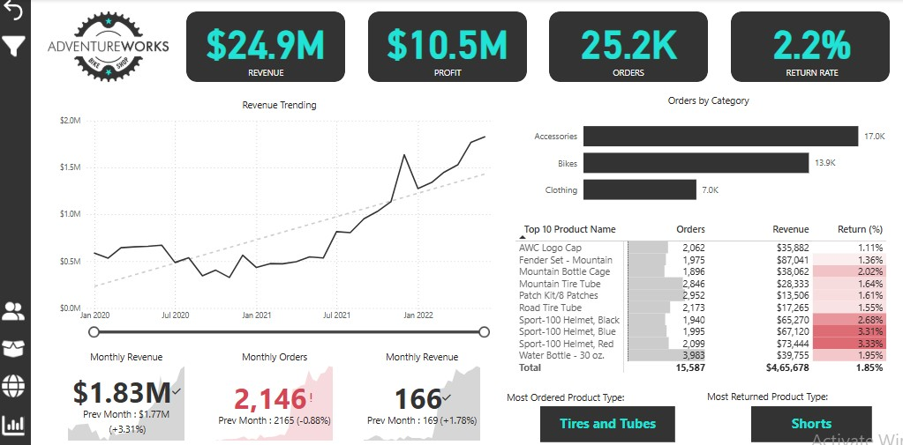
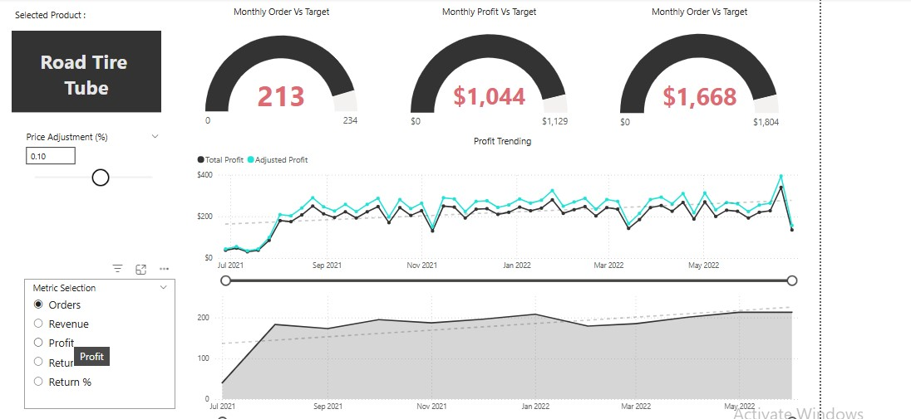
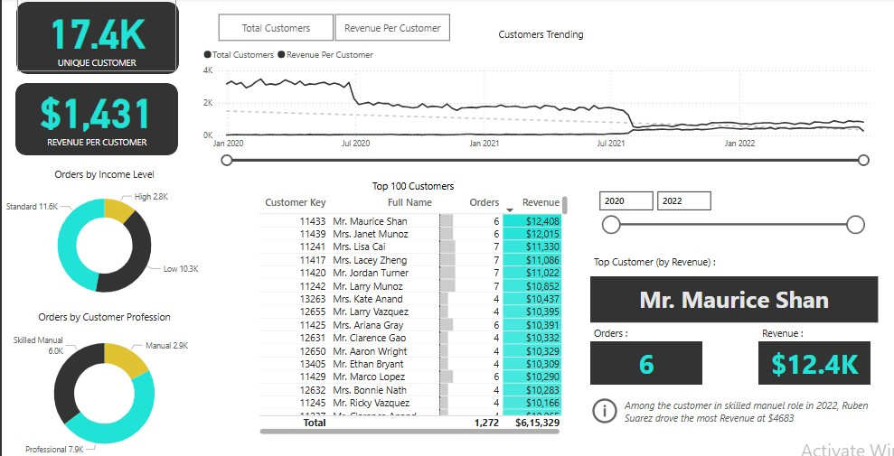
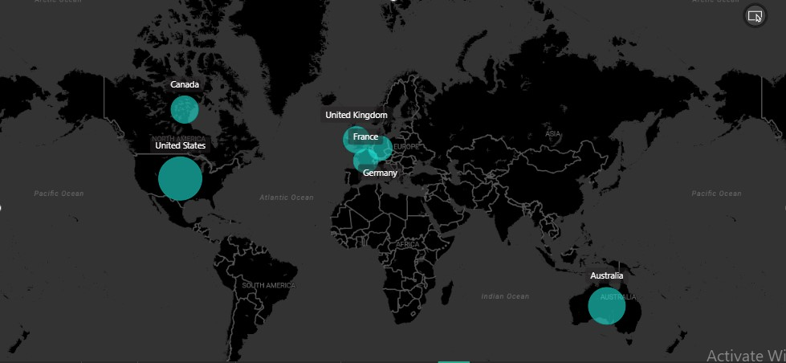

# AdventureWorks Power BI Dashboard Project 🚀

This project presents an in-depth analysis of the AdventureWorks dataset using **Power BI** to generate actionable business insights, focusing on sales, customer behavior, product performance, and market expansion.

## 🔍 Key Insights and Features:
1. **Overall Business Performance**  
   - Revenue: $24.9M | Profit: $10.5M (strong margin)  
   - Total Orders: 25.2K | Return Rate: 2.2% (low return rate)  
   - Upward revenue growth from Jan 2020 to mid-2022, with a slight decline in monthly orders (-0.88%)  

   

---

2. **Sales & Product Performance**  
   - Top-Selling Categories: Accessories, Bikes, and Clothing  
   - Most Sold Product: Tires & Tubes  
   - Most Returned Product: Shorts (2.85% return rate)  

   

   **Actionable Insights:**  
   - Leverage high-selling products with bundle deals.  
   - Investigate high return rates and optimize sizing/quality for Shorts and Helmets.  

---

3. **Customer Behavior & Segmentation**  
   - 17.4K Unique Customers | $1,431 Revenue per Customer  
   - Order distribution by income level: Standard, Low, and High Income  
   - Top Professions: Professionals (highest spending), Skilled Manual, Manual Workers  

   

---

4. **Regional Sales & Market Expansion 🌍**  
   - Top Markets: US, Canada, UK, France, Germany, and Australia  
   - Untapped Potential in Asia, South America, and Africa  

   

---

5. **Product-Specific Analysis: Road Tire Tube**  
   - Underperformance observed in sales, revenue, and profit targets.  
   - Impact of Price Adjustments analyzed to forecast future demand.  
   - Seasonality and competitor pricing considered to optimize sales strategies.  

---

## 📸 Dashboard Screenshots:  
Here are the screenshots of key dashboard sections for better visualization:  
- **Overall Executive Dashboard**  
    

- **Customer Behavior Dashboard**  
    

- **Sales and Product Performance Dashboard**  
    

- **Regional Sales Performance (Map)**  
    

## 🔗 Project Summary:
This dashboard provides critical insights into AdventureWorks' overall performance, customer trends, product sales, and market opportunities. The actionable recommendations aim to boost revenue, reduce return rates, optimize pricing, and expand market reach.

## 📂 Tools and Techniques:
- **Power BI:** Data visualization and dashboard creation  
- **Data Analysis:** KPIs, revenue trends, product performance, customer segmentation  
- **Advanced Techniques:** Slicers, drill-throughs, trend analysis, DAX calculations  
